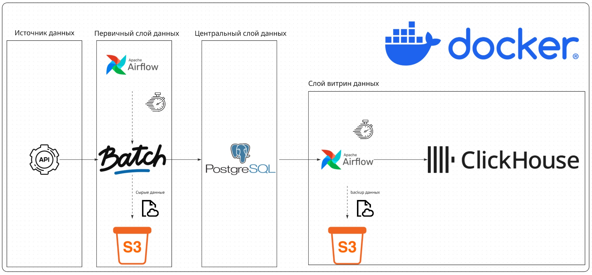

# simple_airflare

Проект представляет собой систему сбора и аналитики данных о направлениях авиаперелётов, предназначенную для изучения динамики цен, популярности маршрутов и выявления актуальных трендов в сфере путешествий. Он позволяет автоматизированно получать, обрабатывать и хранить информацию, что даёт возможность строить удобную аналитику по направлениям, сезонам и другим параметрам, важным для туристов, аналитиков и компаний из сферы travel tech.
## 🧰Стек технологий
### Основные инструменты
- **Python**
  - **pandas** - Очистка и обработка данных
  - **requests** - Получение данных по API
  - **logging** - Логирование
  - **json** - Форматирование данных
  - **datetime** - Обработка даты/времени
- **Airflow** - Оркестрация процессов


### 🗃️Инфраструктура
- **Postgres** - Основное хранилище, очищенных и нормализованные данные
- **ClickHouse** - Аналитическое хранилище, хранящее денормализованные данные
- **Docker** - Контейнеризация всех компонентов
- **MinIO** - S3-совместимое объектное хранилище

### 🧱Структура проекта


## 📖Описание работы проекта
Проект ежедневно получает пакетные данные с API Travelpayouts, очищает и нормализует их, после чего загружает в PostgreSQL. Сырые данные параллельно сохраняются в MinIO для резервного хранения. Из PostgreSQL денормализованные данные выгружаются в ClickHouse для аналитики и построения витрин.

## ⚙️ Инструкция по установке и запуску
1. Клонируйте репозиторий:
```bash
git clone https://github.com/NG-data/simple_airflare.git
cd simple_airflare
```
2. Запустить в директории проекта для того чтобы сделать init.sh исполняемым:
```bash
chmod +x postgres_init/init.sh
```
2. Запускаете проект при помощи Docker compose:
```bash
docker-compose up -d
```
3. Собирайте статистику и ищите оптимальные даты для перелетов 😜
